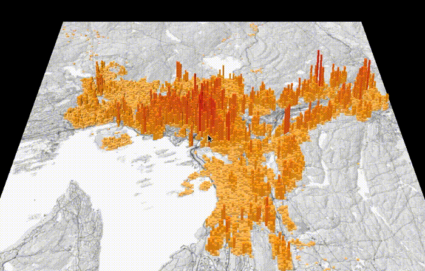

# 3D-visning av statistikk

I <a href="https://github.com/GeoForum/veiledning08">veiledning 8</a> laget vi et interaktivt kart over befolkningen i Oslo kommune. 
Her skal vi vise de samme dataene i 3D med bruk av WebGL og <a href="http://threejs.org/">Three.js</a>. 

I tillegg til fargen angir også høyden hvor mange som bor i hver rute på 100 x 100 meter. 

[Fordeler og ulemper med 3D]

Three.js er et biblioteket som gjør det mye enklere å lage 3D-visualiseringer i nettleseren. Det er ikke laget spesielt for kart, men heldigvis er det lett å konvertere UTM-koordinater til Three.js sitt koordinatsystem. 

### Bakgrunnskart fra Kartverket

Vi skal vise søylene oppå det samme bakgrunnskartet som vi brukte i <a href="https://github.com/GeoForum/veiledning08">den forrige veiledningen</a>, men siden Three.js ikke har støtte for kartfliser (tiles), skan vi laste inn kartet som ett stort bilde. Vi bruker her <a href="http://kartverket.no/Kart/Gratis-kartdata/WMS-tjenester/">WMS-tjensten til Kartverket</a> for å laste ned kartbildet. 
 
Web Map Service (WMS) er en kjent kartstandard som lar deg laste ned kart i ulike projeksjoner og hvor du selv kan bestemme hva som skal vises på kartet (<a href="http://openwms.statkart.no/skwms1/wms.topo2.graatone?SERVICE=WMS&VERSION=1.3.0&REQUEST=GetCapabilities">se oversikt</a>). Det er ikke mulig å laste inn bildet direkte fra Kartverkets server til Three.js, pga. sikkerhetsinnstillingene i nettleseren. I steden lagrer vi en lokal kopi av kartet. 

Vi skal vise befolkningsstatistikk for Oslo kommune, og hvis vi tenker oss en firkant rundt polygonet for Oslo kommune vil denne ha følgende koorinater i UTM 33:

Sørvest: 253700, 6637800
Nordøst: 273800, 6663700
 
For å hente ut dette kartutsnittet for Oslo kan vi bruke følgende URL: 
 
<a href="http://openwms.statkart.no/skwms1/wms.topo2.graatone?SERVICE=WMS&VERSION=1.3.0&REQUEST=GetMap&CRS=EPSG:32633&BBOX=253700,6637800,273800,6663700&WIDTH=2010&HEIGHT=2590&LAYERS=fjellskygge,N50Vannflate,N50Vannkontur,N50Elver,N50Bilveg,N50Bygningsflate&FORMAT=image/jpeg">http://openwms.statkart.no/skwms1/wms.topo2.graatone?SERVICE=WMS&VERSION=1.3.0&REQUEST=GetMap&CRS=EPSG:32633&BBOX=253700,6637800,273800,6663700&WIDTH=2010&HEIGHT=2590&LAYERS=fjellskygge,N50Vannflate,N50Vannkontur,N50Elver,N50Bilveg,N50Bygningsflate&FORMAT=image/jpeg</a>

Her har vi angitt at kartprojeksjonen ska være UTM 33N (CRS=EPSG:32633), utsnittet er definert av koordinatene over (BBOX=253700,6637800,273800,6663700), bildet skal være 2010 x 2590 px (WIDTH=2010, HEIGHT=2590), og vi ønsker å vise følgende kartlag (LAYERS): fjellskygge, vann, elver, bilveg og bygninger. URL'en returnerer dette kartet: 

